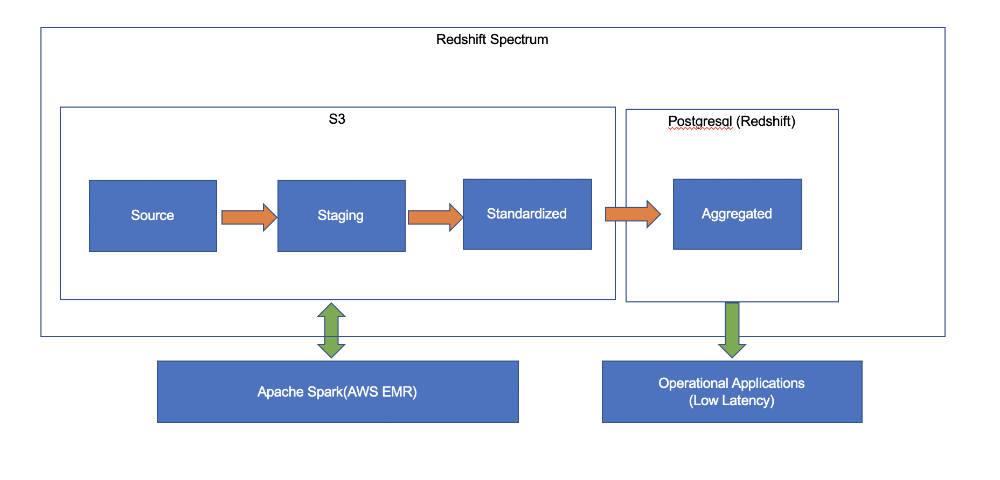

# Introduction

This document describes the proof of concept (PoC) design for the application to ingest sample vehicle data in csv, transform and load it into apache spark and export the aggregated results into postgresql database.

# Prerequisites

* This document provides instructions assumes the execution on MacOS or other unix based OS, for windows OS the invocation command may slightly vary.
* Docker-machine or Docker desktop installed and configured to use host OS disk.
* Python version 3 installed.


# Setup
Replicate the git repository or download the source code locally.
* Step 1: Pull the pyspark docker image
```bash
docker pull godatadriven/pyspark
docker pull bitnami/postgresql
```
* Step 2: Start the postgresql database container.
```bash
docker-compose up -d
```
* Step 3: Run the Entry_Point.py python file.
```bash
docker run --network "${PWD##*/}_app-tier" -v "$(pwd):/artifacts" godatadriven/pyspark --driver-class-path /artifacts/utils/postgresql-42.2.12.jar --jars /artifacts/utils/postgresql-42.2.12.jar /artifacts/Entry_Point.py
```

# Setup Verification
* Step 1: Connect to database container with credentials configured in docker-compose.yml file.
```bash
docker exec -it postgresql-server psql -d my_database -U my_user
```
* Step 2: Connect to database container with credentials configured in docker-compose.yml file.
```postgres-psql
SELECT * FROM PUBLIC.AGGREGATED_VEHICLE LIMIT 20;
```
If the query returns sample records then it means the setup was correct and the pipeline ran without syntactic errors.

# Design
This application has been created for the demonstration purpose only. To get started faster, I intentionally have used docker container images for PySpark and PostgreSQL that are already available. As a result, we are dependent on the functionality available out of the box.

## Assumptions and Choices
* Cloud Platform - AWS.

Since the source data is provided in AWS S3, we are assuming that is where most of the data is stored. If it turns out that we need to use another cloud platform, the choice of services and components need to reevaluated. For example, Amazon Redishift and Google Bigquery are both managed data warehousing services but they work differently and have different pricing models.
But the functional principles of the design should always be technology agnostic. For example, if analytical consumers of the data need high parallelism it does not matter if we use Redshift or Bigquery but the application needs to scale horizontally.

* Source System: Nature of load (Incremental or Full) and History.

We are assuming that new data that will be delivered will be incremental. In case the complete history is provided each time then design need to be updated to pick vehicle id with the latest load date (AUDIT_CREATED_AT column).

* Data Quality and Data Governance.

There are some records with year as price class or vehicle id being null etc. But we are assuming that consumers will set the expectations for the data quality according to the given business case.
However, we do add audit columns like when the data was loaded and standard data quality checks e.g. engine_capacity or age columns cannot be negative and we will flag the records that do not pass such tests.

* Data Model.

We are going to keep  both types of the consumers in mind, the data scientists who would prefer scale over low latency and operational systems who would prefer low latency and consistency over volume of data.
We will review this topic in detail in a later section.

Now, that we are aware of assumptions that we are making and conscious choices we have made, let's take a look at the following diagram to understand the design better.



Since our source data is in  S3, to keep the data movement at minimum we will store transformed data in S3 as well. Currently, we are using apache spark in a docker container running on locally. however, the pyspark code we have can be run on AWS EMR cluster with little bit of modification. Local file system can be replaced by S3 and standalone spark installation with AWS EMR.

Spark configuration requires AWS credentials in order to natively access S3 even if the files are publicly available. Therefore, we will first download those file within docker container and then load into Spark.

After, we have loaded the source data into Spark, we can create first layer of the design i.e. Staging. In this layer, we will add additional metadata columns AUDIT_CREATED_AT and AUDIT_CREATED_BY to help identify when each record was loaded into the table as we append new data into this table,

```python
    save_query_results(
...
        sql="""
            SELECT
                *,
                CURRENT_TIMESTAMP() AS AUDIT_CREATED_AT,
                "1_STAGING_VEHICLE" AS AUDIT_CREATED_BY
            FROM
                Source_Vehicle
        """,
...
    )
```

As you may have noticed, we are keeping metadata specific to source file into vehicle.json file and are writing generic code that can be used to load multiple files by just creating new json metadata file with new schema and relevant information.
We don't want to apply any transformation or data manipulation at this stage because this is the first point in the pipeline where we have complete control of incoming data.

Now, we will apply standardization to the table in the Standardization layer. Currently, we are applying following types standardization to data:

* Column name changes: For example, changing the columns names, i.e. bodytype to body_type etc.
* Column data type: All the columns in the source data are of string we will change them to appropriate types.
* Standard data quality check: We will add some standard data quality checks i.e. regex to check whether the number column is actually a number or not etc.

```python

def get_column_dq_check_expr(field):
...
    if (target_type == "date"):
        return "(TRIM(" + field_name + ") RLIKE " + "'[12]\\\\d{3}-(0[1-9]|1[0-2])-(0[1-9]|[12]\\\\d|3[01])' OR " + field_name + " IS NULL)"
    elif (target_type == "integer"):
        return "(TRIM(" + field_name + ") RLIKE " + "'^\\\\d+$' OR " + field_name + " IS NULL)"
...
```

```python
    save_query_results(
...
        sql="""
            SELECT
                """ + ",\n\t".join(data_type_conversion_select_list) + """,
                """ + " AND ".join(standard_dq_check_expr_list) + """ AS DQ_STD_TYPE_CHECK,
                """ + get_non_negative_check_expr() + """ AS DQ_NON_NEGATIVE_CHECK,
                CURRENT_TIMESTAMP() AS AUDIT_CREATED_AT,
                '2_STANDARDIZATION_VEHICLE' AS AUDIT_CREATED_BY
            FROM
                Staged_Vehicle
        """,
    )
...    
```

All the steps we used so far are completely reusable, meaning once we create new json metadata file with all the required information, we can load and standardize new tables without changing or redeploying the code.

We have only one table at this point, and most of the managed cloud data warehousing or analysis services are columnar. So it makes sense to use the data in it's denormalize form. If we normalize the table, it is very likely that we will end up joining them in the end to perform the analysis and most of the distributed and parallel computing frameworks do not perform well in such cases.
Hence, we will keep the table in the denormalized form as it is in Standardized layer until we discover there are more entities to be added in the data model.

However, it is also possible that some downstream application would like to access smaller/aggregated form of the data at a much lower latency than what Spark can offer. For, all such downsteam systems, we will create export of subsets of data into postgresql.

Postgresql database container in our design can be thought as a Amazon Redshift in a real-world use case. Since rest of our data is stored in S3, we can use Amazon Redshift spectrum to access both data stored in S3 and in Redshift. This use case is also possible in Google Bigquery with help of external tables on top of data stored in Google Cloud Storage.

```python

def aggregate_vehicle_data(spark_session,vehicle_metadata):
    non_aggregated_columns = [
        "make",
        "build_year",
        "price_class"
    ]
    
    export_query_results(
...
        sql="""
            SELECT
                COUNT(*) AS num_of_vehicles,
                SUBSTRING(country, 3) as COUNTRY_CODE,
                """ + ",\n\t\t".join(non_aggregated_columns) + """,
                CURRENT_TIMESTAMP() AS AUDIT_CREATED_AT,
                "3_AGGREGATION_VEHICLE" AS AUDIT_CREATED_BY
            FROM
                Standardized_Vehicle
            GROUP BY
                """ + ",\n\t\t".join(str(x) for x in range(2, len(non_aggregated_columns) + 4)) + """
            ORDER BY
               1 DESC,
               4 DESC
        """,
...
     )
...

def export_query_results(spark_session,sql,table_name,append_mode):

    result_dataframe = spark_session.sql(sql)

    #TODO: Move credentials to an encrypted file and create a separate database schema
    spark_session.sql(sql).write \
        .mode(append_mode)\
        .jdbc("jdbc:postgresql://postgresql-server:5432/my_database", "public."+table_name,
              properties={"driver":"org.postgresql.Driver","user": "my_user", "password": "Change123"})
...

```

Amazon Redshift is accessible using postgresql jdbc driver and therefore our code should be able to export data to that service.

For the demonstration purpose, we can pass sql query as an additional argument at the runtime after we have run the pipeline at least once, that will run the query on the stored data so that we can verify the resuls.

```python

def demo_query_execution(spark_session,sql,vehicle_metadata):
...
    #TODO: This is just a demo function; store the hive metastoe into persistent storage instead of reading the tables on every run.
    for table_name in table_list:
        saved_dataframe = spark_session.read.parquet(vehicle_metadata["data_dir"] + table_name)
        saved_dataframe.createTempView(table_name)
    
    spark_session.sql(sql).show(10)

```

We tried to justify the choices we made and it is never a bad idea to revisit those decisions when we discover new information about the users of the platform, source/downstream systems and nature of data.

# Next Steps

